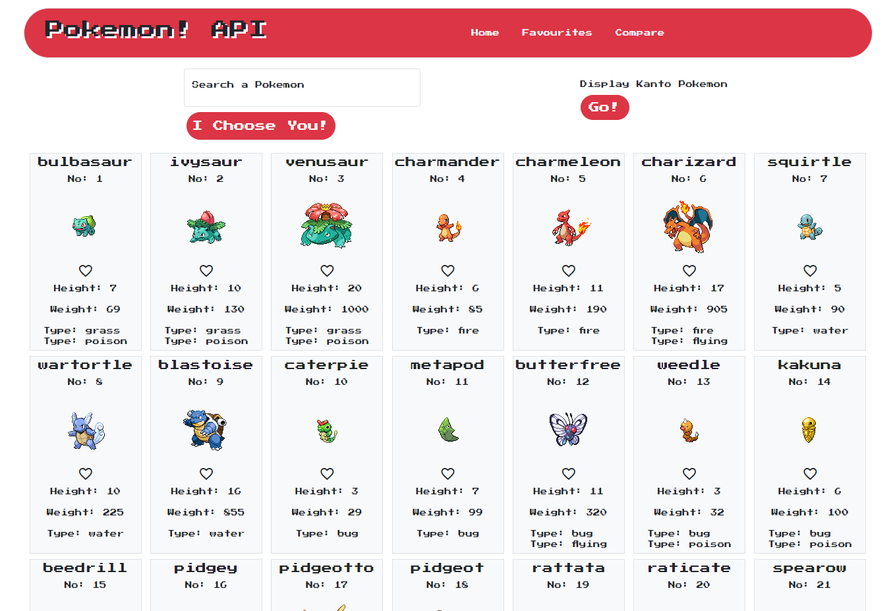
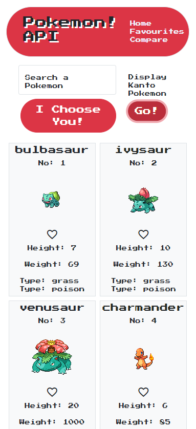

# pokemon-api

Pokemon API - [Github Repo](https://github.com/Ryocon/pokemon-api)
Deployed - [Github Pages](https://ryocon.github.io/pokemon-api/)

  ## Table of Contents
  - [Description](#description)
  - [Installation](#installation)
  - [Screenshots](#screenshots)
  - [Challenges](#challenges)
  - [Future Developments](#future)
  - [Tests](#tests)
  - [License](#license)
  - [Credits](#credits)
  - [Questions](#questions)
  

  ## Description
  This project uses the PokeAPI to dynamically render Pokemon details for the user to browse. The user can also search for any individual Pokemon that can be found on the API. Users can save their favourite Pokemon and see them listed together. A user can also search two Pokemon and compare detailed stats side by side. The project uses Bootstrap for styling as well as local CSS and is responsive.

  ## Installation
  This project does not require installation and is hosted on github pages.

  ## Screenshots
  

  ## Challenges
  Learning a new API in a short space of time was difficult but previous project knowledge allowed me to get to grips quite quickly. Deciding how to best meet the project requirements in both the script logic and visuals took a few iterations but I eventually decided on this outcome which I hope meets the requirements. I also used Bootstrap for this project where I would normally use TailwindCSS and it caused a few styling issues. I could not get the container/grid styles to display how I wanted so had to switch to calling flexbox styling to overcome this. Within the JavaScript file there are many things that could most likely be done a lot cleaner and easier (see multple fetches!) but I went with what I knew would work as well as well as some experimentation to find the right solution. I used previous project knowledge and online resources to help point me to solutions for any issues I had.

  ## Future Developments
  More features could be added such as searching for regions, generations, types of Pokemon etc. I would like the user to be able to see which Pokemon they have already favourited and to be able to clear them from favourites with a button press. I had already tried to implement this but ran into difficults executing it fully. I would make some styling updates such as making the compare search bars reversed so they would more side by side in line with the Pokemon they display. I also feel the initial search and display Pokemon button could be revised as they are not uniform enough for my liking. Due to the fetch not being async+await (but it does use .then!) some of the Pokemon do not always render in the order they should do which is something that can be addressed in the future. Remaking this project using a framework such as React is something I will consider taking on in the future.

  ## License
  This project uses the MIT license.

  ## Credits
  There were no additional collaborators for this project.

  ## Tests
  There are no tests available for this project.

  ## Questions
  For any questions please contact via Github or email.

  Github - https://github.com/Ryocon

  Email - roconn25@gmail.com